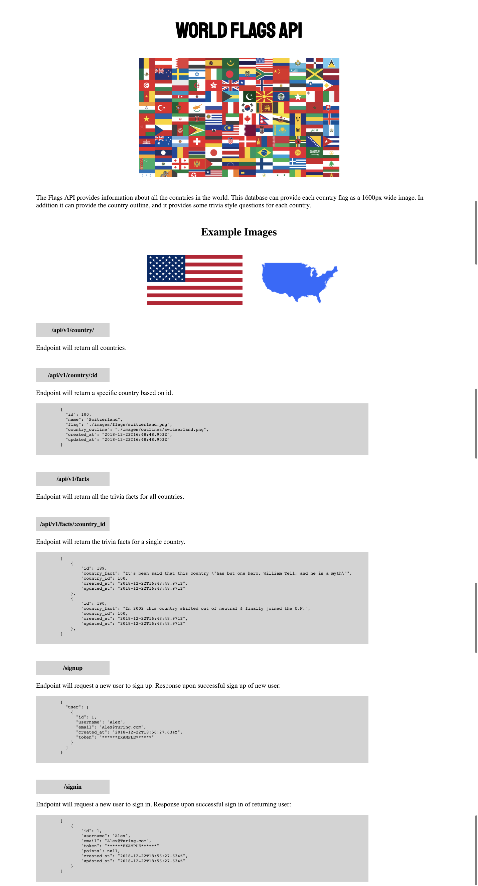
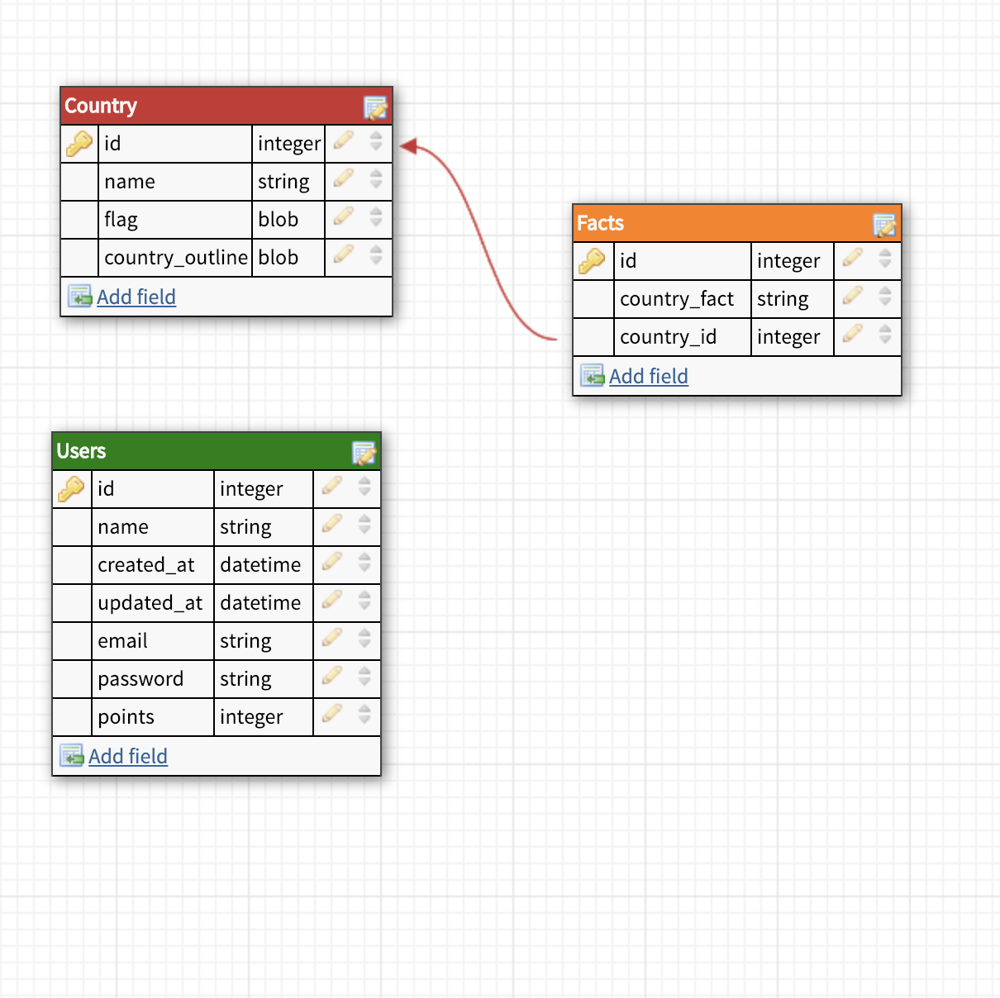

# Flag Trivia Back-End

#### Get ready to build your own geographt-themed game with these jeopardy style questions, and flag and country outlines. With this API you can have access to all the information necessary to build you're own geography trivia game!

### See it Live

[World of Flags](http://flagz4u.herokuapp.com/) on Heroku.

## Tech Stack
- Node.js
- Express
- Knex.js
- Heroku
- Mocha
- Chai 
- Chai-http
- Nightmare.js
- Bcrypt

## Screenshots

### API Landing Page


### Schema


## How to Use:

#### Install and Start Server
* Clone this repo.

* `npm install`

* `npm start`

#### Create Postgres Database and Run Migrations
* `psql CREATE DATABASE countries`

* `knex migrate:latest`

* `knex seed:run`

#### Testing 
World of Flags uses Mocha and Chai for backend testing.
* `To test run npm test`

## API Endpoints
### Countries
#### GET all countries
```
/api/v1/countries 
```

Returns an array of all country objects

#### GET a specific country
```
/api/v1/countries/:id
```

Returns the specific country object. Example:
```
{
  "id": 100,
  "name": "Switzerland",
  "flag": "./images/flags/switzerland.png",
  "country_outline": "./images/outlines/switzerland.png",
  "created_at": "2018-12-22T16:48:48.903Z",
  "updated_at": "2018-12-22T16:48:48.903Z"
}
```

### Questions

#### GET get all questions/facts
```
/api/v1/facts
```

Returns an array of all question objects.

#### GET questions for a specific country
```
/api/v1/facts/:country_id
```

Returns an array with a specific question object. Example:
```
[
  {
    "id": 189,
    "country_fact": "It's been said that this country \"has but one hero, William Tell, and he is a myth\"",
    "country_id": 100,
    "created_at": "2018-12-22T16:48:48.971Z",
    "updated_at": "2018-12-22T16:48:48.971Z"
  },
  {
    "id": 190,
    "country_fact": "In 2002 this country shifted out of neutral & finally joined the U.N.",
    "country_id": 100,
    "created_at": "2018-12-22T16:48:48.971Z",
    "updated_at": "2018-12-22T16:48:48.971Z"
  },
]
```

### Users

#### POST Sign in with a username and password
```
/signin
```

Returns an id, username, token, and points in a user object. Example:
```
[
    {
        "id": 1,
        "username": "Alex",
        "email": "Alex@Turing.com",
        "token": "******EXAMPLE******"
        "points": null,
        "created_at": "2018-12-22T18:56:27.634Z",
        "updated_at": "2018-12-22T18:56:27.634Z"
    }
]
```

#### POST Sign up a new user with a username, email, and password
```
/signup
```

Returns an id, token, and username. Example:
```
{
  "user": [
    {
      "id": 1,
      "username": "Alex",
      "email": "Alex@Turing.com",
      "created_at": "2018-12-22T18:56:27.634Z",
      "token": "******EXAMPLE******"
    }
  ]
}
```

# To Contribute to the Project:

- Follow the setup instructions above to get the app up and running locally on your machine.

- Our list of Issues on GitHub Issues: (https://github.com/Tobin-jn/Flags-Backend/issues)
  Please use these issues to direct the contributions you desire to make.

- To send a Pull Request via GitHub:
    - Checkout a new branch
    - Add a forked version of this repo as your remote
    - Push up changes to your forked repo
    - Request the Pull Request to the original repo
    - Include a brief commit message details the changes you have made
    - Make sure to write tests for the front end
    - Make sure all tests are passing before you make a Pull Request
    - Before submitting, Rebase your work on the current master branch


## Database created and designed by 
* [Ben Hayek](https://github.com/benjaminhayek)
* [Tobin Nelson](https://github.com/Tobin-jn)
